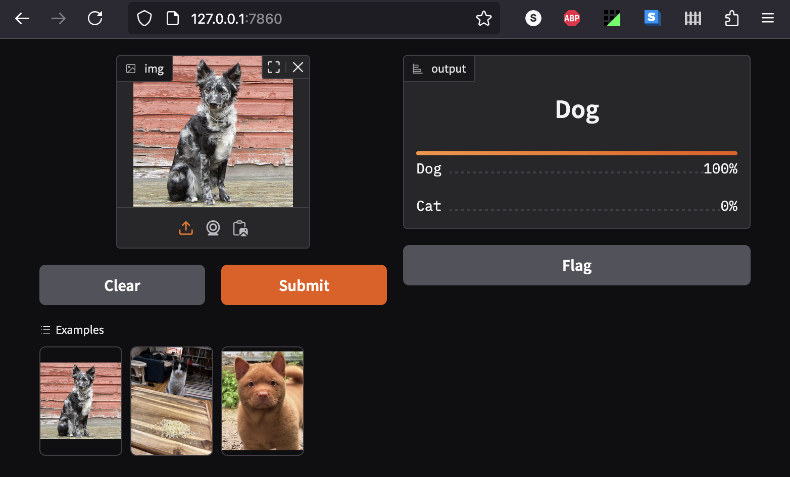

# Working through https://course.fast.ai/, May - ?? 2026, with Recurse study group

[Paul Winkler](https://www.recurse.com/directory/5804-paul-winkler)

Doing "Practical Deep Learning for Coders, Part 1" (chapters 1-8), as part of a weekly study group that spontaneously formed at the
[Recurse Center](https://www.recurse.com/).

AGAIN!!

I've forgotten much of last year, and another study group spun up - great
opportunity to review, reinforce, explore more!

## RECURSE? WHAT IS

I highly recommend [Recurse](https://recurse.com) if you
want a place to rekindle your excitement about programming and learn in a
collaborative, encouraging environment. It's phenomenal. And free!


# What's in this repo

- This README to dump notes as I go

- `fastbook`: a subtree from https://github.com/fastai/fastbook not sure if I'm
  going to use this.

- `course22`: a subtree from https://github.com/fastai/course22 for me to work
  on lesson notebooks

# Where's last year's stuff?

It's in [another
repo](https://github.com/slinkp/practical-deep-learning-fastai)
... i decided it was easier / cleaner to start over.
There is some copy/paste in this README, largely to avoid duplicating
workarounds for boring stumbling blocks like updating outdated dependencies.
Otherwise it's a clean do-over.

# A Practical / Opinionated Overview: How to Do the Course

The course consists of both youtube lecture videos, jupyter notebooks linked
from the course web page, AND a free ebook repository (also in jupyter notebook form).

The book material is a good supplement to the
videos and notebooks, but it's a bit challenging to correlate them:

- The course website is the "correct" order to work through the material.
- Some of the book chapters flesh out video content in more detail, which is a
  nice way to reinforce it.
- The book chapters are in a totally different order!
  - This means there are a few places where the book will refer back to
    chapters you haven't read yet. I tried to just roll with it.

It's really essential to treat this as hands-on and not just video content to
consume.

Work through and run the jupyter notebooks: definitely all the notebooks linked
from the website, and probably also most or all of the book
versions of them.

# How this repo is structured

I wanted a place to combine all my notebooks from website exercises AND from
the textbook, and the notes in this file.

- The [book repo](https://github.com/fastai/fastbook) has been cloned as a git
  subtree in `fastbook/`
  - i'm not sure i'm going to do these this time; so much was redundant.
  - The original, untouched source of each chapter is in
    `fastbook/clean/*.ipynb`

- Lesson notebooks for each lecture will be put in `course22/`,
  regardless of whether I ran them on Kaggle, Collab, or whatever.

## Errata and missing updates from book & lesson notebooks

Lots! Inevitably there is code in the 3+-year-old material that no longer works as-is.
I will put every fix and/or workaround that I find in this file and/or the
notebook copies in this repo.

No guarantees: check the dates on this repo! Check if the upstream course is
updated! This stuff works for me as of now, aka spring 2026; at the time of this writing, the video
lectures and the book [from its github
repo](https://github.com/fastai/fastbook) were largely circa early 2022.

## How I run the notebooks

There are so many ways! I landed on this:

- I tried both Kaggle and Google Colab. Both are fine. The Jupyter experience
  isn't exactly the same in them. No strong opinion here.

- There are mentions of running notebooks on Paperspace too. I ignored this as I
  really didn't need a third way.

- Some of the notebook code is quite slow to run, and you won't know until you
  try. This can really interrupt the flow of learning :-(
  For example, in lesson 4 book chapter 10, I wish I had skipped starting on
  Kaggle and had gone straight to Colab with paid credits for an A100 (it took about 100
  minutes there in 2025, would have been literally hours longer on kaggle's fastest
  free GPU).  The Lesson 7 notebook "Road to the Top part 3" is for a Kaggle
  competition, so that's probably the right place to run it - but it took over **8 hours** to run on kaggle!

- Skip anything to do with `Voila`; I think it's just obsolete.

- Running locally on your computer is NOT necessary. I did this sometimes in 2025
  just for "fun" and curiosity; this time I've decided not to bother.
  Last time around, some of the notebooks WOULD NOT run locally for me at all;
  some theoretically work but would require enough GPU/CPU time that it's not
  practical.
  I tried to record in the 2025 README (not this one!) which ones did and did
  not work locally.
  I'll copy that info here if I remember. Later.
  Your hardware will be different. YMMV.

## Notes on my lesson process

Still may evolve, this is what worked / works *for me*:

I start by watching the lesson video.

OLD PROCESS BELOW - needs update:

When there are Kaggle notebooks linked from the lesson overview page,
I do this in Kaggle:
- Make a copy via "Copy and Edit"
- File -> Link to Github (this repo)
- Immediately do a quick save, call it "Initial copy",
  and commit that to github in the `lessons/` directory.
  I add the lesson number as a prefix.
  For example, here's a screenshot of saving the initial copy of lesson 3:


Then I periodically save my work in Kaggle and commit it to github.


## Lessons 1 (Getting Started) and 2 (Production)

TODO: most of last year's stuff here was about getting stuff running locally
and I just decided not to bother :D

### Meta note: Skip book chapter 2!

I found that while it's worth reading the other book chapter notebooks, because they have
background and info that isn't in the video lessons or kaggle notebooks ...
This particular chapter has so many obsolete
commands and API calls that need fixing; outdated recommendations for deployment, etc.

Since deployment is the whole focus of the chapter, it's probably the most
dated / inaccurate content in this whole series.
In particular, Viola no longer seems to be a relevant thing.

### Deploying to Production

The [lesson 2](https://course.fast.ai/Lessons/lesson2.html) lecture video and
lesson notebooks are sufficient.


### Exporting the notebook code with nbdev

This dependency wasn't mentioned:

```console
$ pip install nbdev
```

The video code at 49:14 is wrong, this works:

```python
import nbdev.export
# Choose your own `name` here
nbdev.export.nb_export("02_app.ipynb", name="deployable_is_it_a_cat")
```

That done, the exported file works when run locally:

```console
$ cd lessons/
$ python deployable_is_it_a_cat.py
* Running on local URL:  http://127.0.0.1:7861

To create a public link, set `share=True` in `launch()`.
```
I can click that URL and upload cats and dogs and get an answer:




### Deploying to Huggingface

TODO:

Last time around, I made a separate repo to deploy from, as that seemed the path of least
resistance.

But, that means manually copying the exported app to it, renaming it `app.py`,
copying needed model files, maintaining a `requirements.txt`, etc.
None of that was hard, but tedious and easy to forget!
Where should I put it instead? Hmm.

TODO:
I had a note that it may be smoother to create the repo on huggingface spaces,
and clone it from there, and then LFS et al may work out of the box?
This may be easier than creating my own repo locally, then adding my huggingface
space as a remote?


### HUGGINGFACE WARNING: need to enable git lfs BEFORE adding a large blob

Don't just dump a big pickle file into your repo!

Other folks ran into this issue:

```
You will also need to install Git LFS, which will be used to handle large files
such as images and model weights.
```

We're going to need to install git-lfs first. On mac:

```
brew install git-lfs
```

Then we can enable it and tell it what file extensions to track:

```
git lfs install
git lfs track '*.pkl'
git lfs track '*.pth'
git lfs track '*.jpg' '*.jpeg'
git lfs track '*.png'
git lfs track '*.gz' '*.tgz'
git lfs track '*.zip'
```

Need to do that BEFORE adding big files, or else you get an error:

```console
$ git push
Username for 'https://huggingface.co': slinkp@gmail.com
Password for 'https://slinkp@gmail.com@huggingface.co':
Enumerating objects: 14, done.
Counting objects: 100% (14/14), done.
Delta compression using up to 8 threads
Compressing objects: 100% (12/12), done.
Writing objects: 100% (13/13), 41.82 MiB | 1.93 MiB/s, done.
Total 13 (delta 2), reused 0 (delta 0), pack-reused 0
remote: -------------------------------------------------------------------------
remote: Your push was rejected because it contains files larger than 10 MiB.
remote: Please use https://git-lfs.github.com/ to store large files.
remote: See also: https://hf.co/docs/hub/repositories-getting-started#terminal
remote:
remote: Offending files:
remote:   - 02_is_cat_model.pkl (ref: refs/heads/main)
remote: -------------------------------------------------------------------------
To https://huggingface.co/spaces/slinkp/is_it_a_cat
```

If you create the repo on huggingface spaces, and clone it from there, that may work out of the box?
I think I hit this issue because I created my own repo locally, then added my huggingface
space as a remote.

To fix in an existing repo: Remove the large file(s), rebasing the removal onto the commit that added it so it's
like it never existed.  Then re-add the file in a new commit AFTER doing `git lfs install`.
That seems to work.

